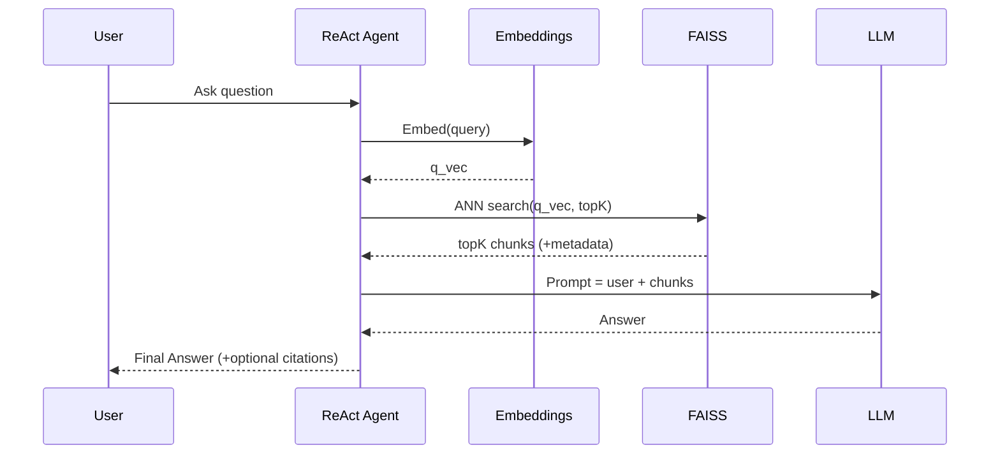

# Long‑Term Vector Memory (RAG) — Integration Guide

> **Goal:** Add semantic long‑term memory to the `ai-agent-lab` using local embeddings + FAISS, and wire it so the ReAct agent can retrieve relevant past knowledge/documents at answer time.

---

## 0) Quick Setup (copy‑paste)

```bash
# From repo root
pip install --upgrade faiss-cpu sentence-transformers numpy scipy

# Build a tiny demo index (uses sample docs embedded in code)
python -m agent.long_memory.faiss_play build

# Ask questions against the index
python -m agent.long_memory.faiss_play query "red fruits"
python -m agent.long_memory.faiss_play query "car wheels"

# Try other local embedding backends
USE_MODEL=bge python -m agent.long_memory.faiss_play query "car wheels"
USE_MODEL=e5  python -m agent.long_memory.faiss_play query "healthcare doctor"
```

> Supported local models:  
> • `minilm` → `sentence-transformers/all-MiniLM-L6-v2` (384 dims)  
> • `bge`    → `BAAI/bge-small-en-v1.5` (384 dims; cosine‑optimized)  
> • `e5`     → `intfloat/e5-small-v2` (384 dims; instruct‑style)

---

## 1) What We Built

- **Embeddings layer**: deterministic, pluggable backends (`minilm`, `bge`, `e5`).  
- **Vector store**: FAISS index saved to `storage/faiss/` with sidecar files for vectors/ids/metadata.  
- **CLI**: `faiss_play.py` for `build` / `query` flows to validate end‑to‑end retrieval.  
- **Chunker**: simple text splitter to create semantically coherent chunks.  
- **Agent hook (ready)**: the `faiss_store.py` + `embeddings.py` API is designed to be invoked from the ReAct controller to prepend retrieved context to the model prompt.

---

## 2) Embedding Fundamentals (deep dive)

### What is an embedding?
A fixed‑length numeric vector **_e_** ∈ ℝ^d (e.g., d=384) representing the meaning of text. Proximity in this space ≈ semantic similarity.

### Why 384/768/1536 dimensions?
- Trade‑off between **expressiveness** and **latency/memory**.  
- More dims → potentially finer distinctions, but larger compute and storage.  
- MiniLM/BGE/E5 “small” models commonly use **384 dims**, which are fast and strong for retrieval.

### Cosine Similarity
We measure closeness by the angle between vectors:

\[\text{cos\_sim}(u,v)=\frac{u \cdot v}{\|u\|\;\|v\|}\]

- Range: **−1 to 1**, in practice **0.0 to 1.0** for positive‑space encoders.  
- Example: `vec("apple")` vs `vec("red fruit")` → **0.82** ⇒ strong similarity.  
- Rule of thumb: **>0.70** similar, **0.40–0.70** related/weak, **<0.40** mostly unrelated (varies by model/domain).

### Distances and Index choice
- **Cosine** (angular) ≈ common for sentence encoders.  
- **IP (Inner Product)** if vectors are normalized ⇒ equivalent to cosine.  
- **L2**: sometimes used; less common for sentence‑level semantic search.

FAISS supports many ANN (Approximate Nearest Neighbor) indexes; we use a simple **Flat** index for correctness while prototyping. For larger corpora, consider IVF, HNSW, or PQ.

---

## 3) RAG Architecture: Where “Retrieval” Fits

**RAG (Retrieval‑Augmented Generation)** = _retrieve_ relevant chunks, then _generate_ an answer conditioned on those chunks.

- **Retrieval** = ANN search in vector DB (FAISS) over your document embeddings.  
- **Augmentation** = attach top‑K chunks to the model prompt as grounded context.  
- **Generation** = your LLM (local or API) composes the final answer with citations/snippets.

### High‑level pipeline
1. **Ingest** files → **Chunk** text → **Embed** chunks → **Index** in FAISS.  
2. **Query** text → **Embed** query → **ANN search** → **Top‑K** chunks → **Prompt** LLM.  
3. (Optional) **Rerank** results (e.g., cross‑encoder or RRF) to improve precision.

---

## 4) System Diagrams

### 4.1 ASCII (Component view)
```
             +--------------------+
             |  Source Documents  |
             +----------+---------+
                        |
                   [Chunker]
                        v
               +--------+---------+
               |  Embeddings (HF) |
               |  MiniLM / BGE /  |
               |  E5 (384 dims)   |
               +--------+---------+
                        |
                      (vecs)
                        v
                 +------+--------+
                 |   FAISS Index |
                 |  (ANN search) |
                 +------+--------+
                        ^
                        |
                  (query vec)
                        |
               +--------+---------+
               |  ReAct Controller|
               |  (RAG Retriever) |
               +--------+---------+
                        |
                  [LLM / Tools]
                        v
                   Final Answer
```

### 4.2 Mermaid (Sequence)


---

## 5) Code Walkthrough (key modules)

> **All modules live in `agent/long_memory/`**

### `embeddings.py`
- Unified factory: `load_embedding_model(backend)`  
- Returns a callable: `embed_texts(List[str]) -> np.ndarray[float32]`  
- Backends: **minilm** (default), **bge**, **e5**.  
- Environment switch: `USE_MODEL=minilm|bge|e5`

### `faiss_store.py`
- `FaissStore(d)` manages FAISS index of dimension `d`.
- `add(vectors, ids, metas)` → ingests batch.  
- `search(query_vec, k)` → returns `(scores, ids, metas)`.  
- `save(dir)` / `load(dir)` → persists index + mapping.

### `chunker.py`
- `chunk_text(text, max_len=256, overlap=32)` → yields overlapping windows.  
- Simple and fast; good enough for getting started.

### `faiss_play.py`
- `build` → creates a small demo index from in‑file sample docs.  
- `query "..."` → performs retrieval with the selected backend.  
- Reads **`USE_MODEL`** env var (defaults to **minilm**).

---

## 6) End‑to‑End Data Flow (detailed)

1) **Build**  
   - Load embedding model (e.g., MiniLM, 384‑d).  
   - Prepare tiny corpus (demo docs) → chunk to ~256 chars with 32 overlap.  
   - Embed chunks → FAISS `add()` → write index + sidecar mapping files to `storage/faiss/`.

2) **Query**  
   - Load the same embedding backend (must match build‑time dim).  
   - Compute query vector → FAISS `search()` top‑K → return `(score, id, meta)` tuples.  
   - Print ranked results; when integrated with the agent, prepend chunks into the controller prompt.

3) **Agent Integration (ready)**  
   - In controller logic: when intent = “knowledge / retrieval”, call `faiss_store.search()` with the query text.  
   - Prepend top‑K chunks to the LLM prompt: e.g.,  
     ```
     Retrieved Context:
     [doc_12] "..."
     [doc_37] "..."
     ```
   - Then continue the standard ReAct loop (tools + final answer).

---

## 7) Terminal Demo (copy‑paste)

```bash
# Build the demo index (MiniLM backend)
python -m agent.long_memory.faiss_play build

# Fruit queries (MiniLM)
python -m agent.long_memory.faiss_play query "red fruits"
python -m agent.long_memory.faiss_play query "which is yellow"

# Switch to BGE
USE_MODEL=bge python -m agent.long_memory.faiss_play query "car wheels"

# Switch to E5
USE_MODEL=e5 python -m agent.long_memory.faiss_play query "who works in a hospital"
```

> If you see mismatched dimensions, rebuild once per backend:
> ```bash
> USE_MODEL=bge python -m agent.long_memory.faiss_play build
> ```

---

## 8) Next Steps

- **Agent‑write memory**: store distilled facts from long chats into FAISS.  
- **Hybrid search**: BM25 keyword + vector (Reciprocal Rank Fusion).  
- **Metadata filtering**: time ranges, tags, types.  
- **Reranking**: cross‑encoder to re‑order top‑K.  
- **Compression**: auto‑summaries of large chunks to increase density.  
- **Citations**: return doc ids/links alongside the final answer.

---

### Appendix: Why cosine ≥ 0.70 ≈ “similar”?

Empirically, sentence encoders place semantically related phrases close on the unit hypersphere. The exact threshold depends on domain, but for many general embeddings:
- **~0.7–0.9** → same topic / near paraphrase  
- **~0.4–0.7** → loosely related  
- **<0.4** → likely unrelated

Use labeled validation pairs from your domain to calibrate precise cutoffs.
